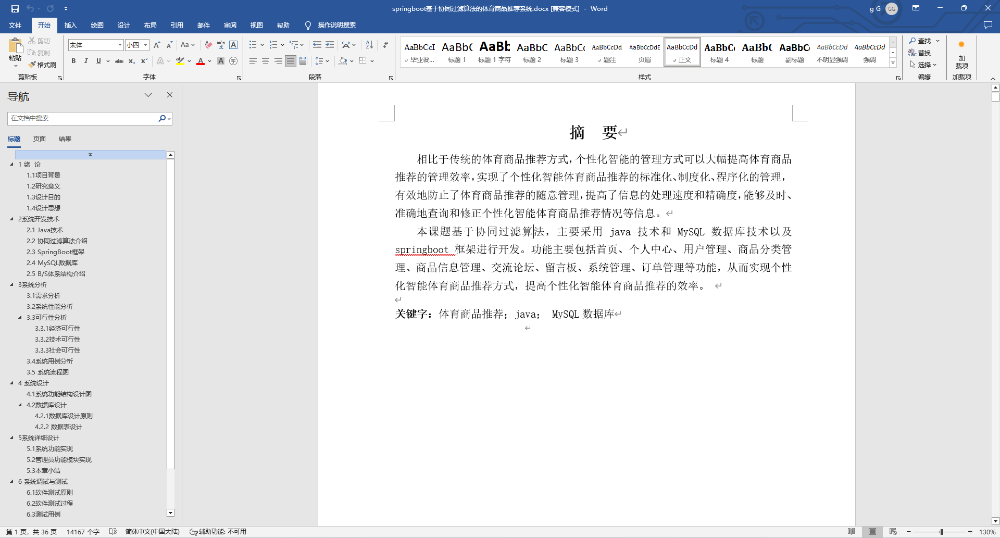
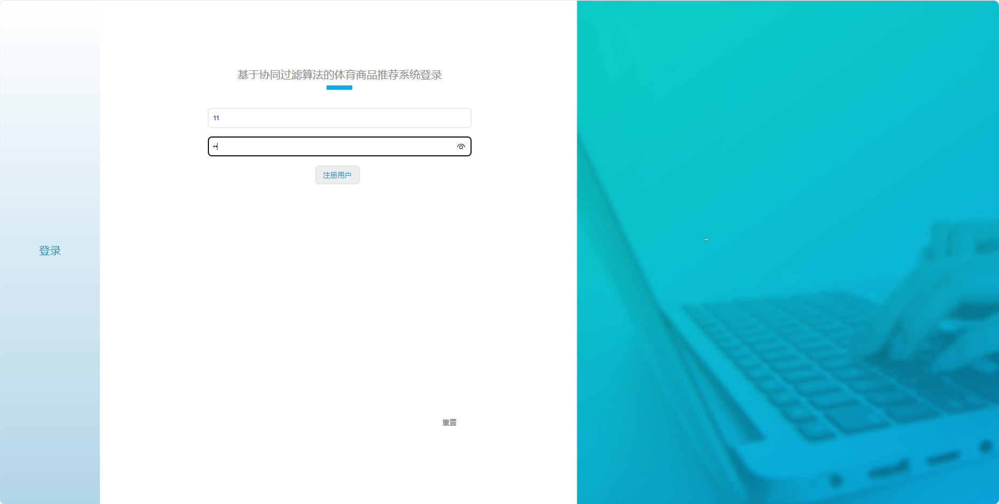
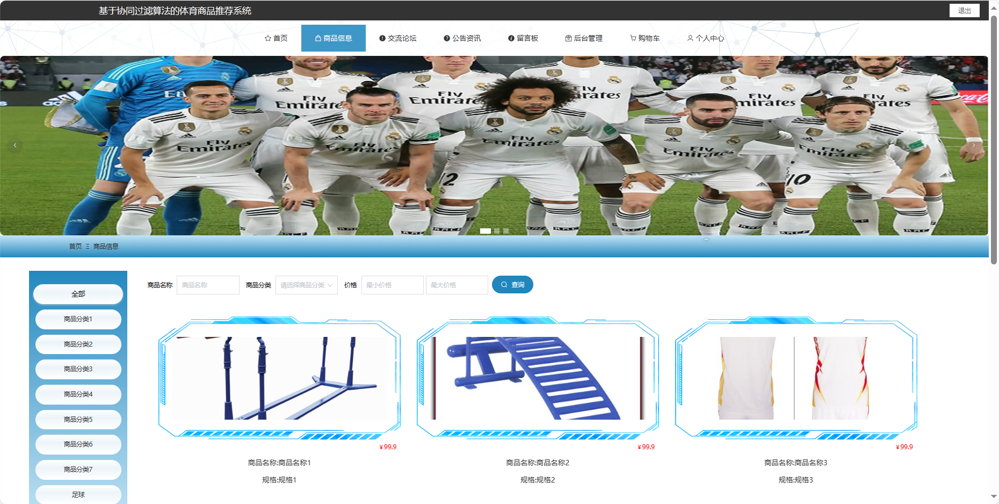
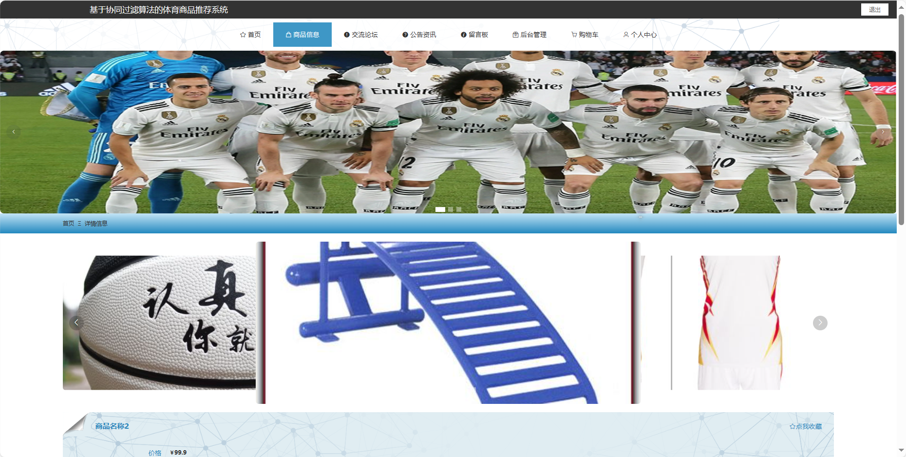
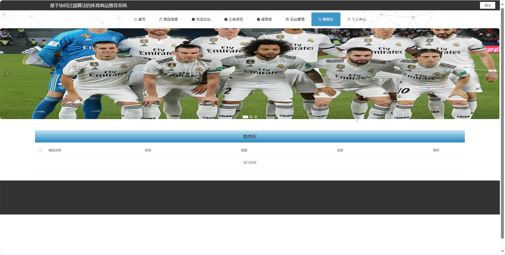
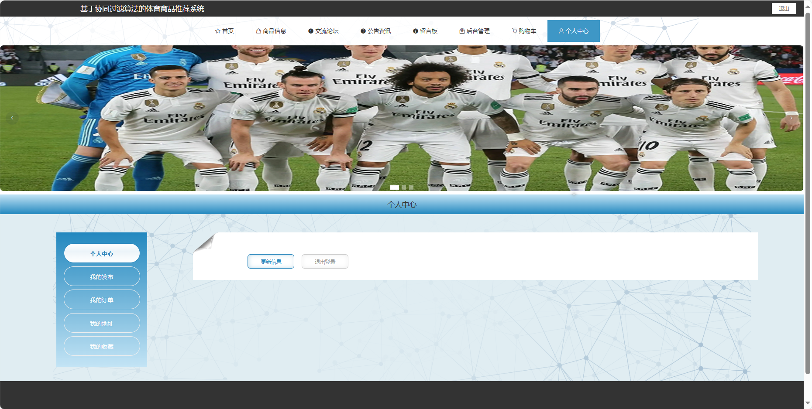
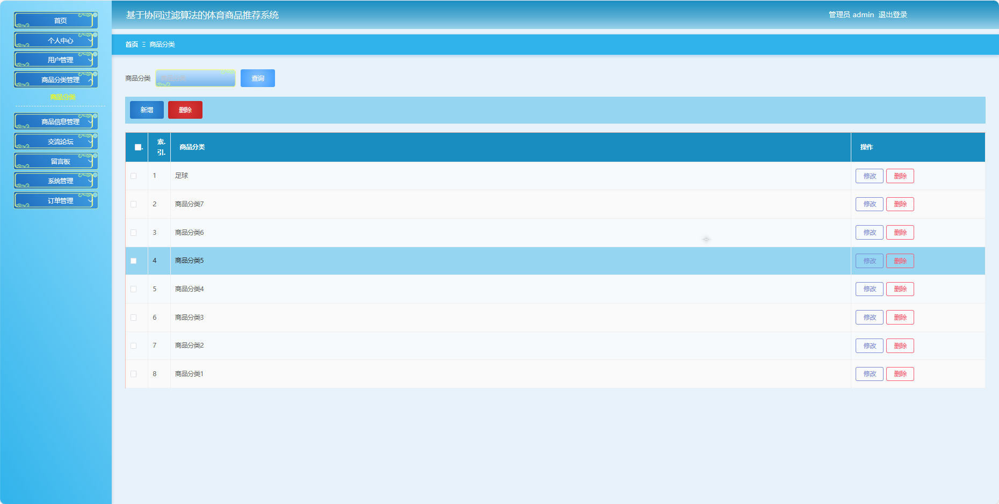
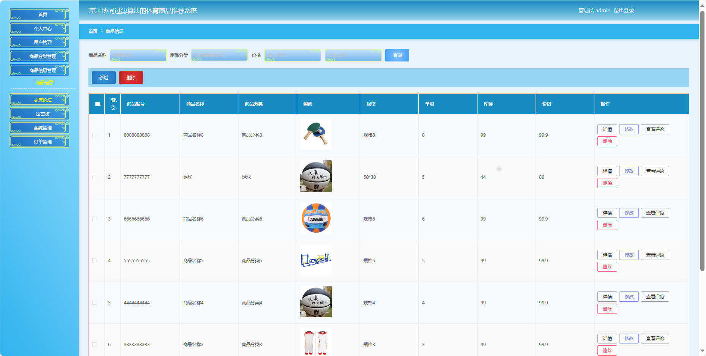
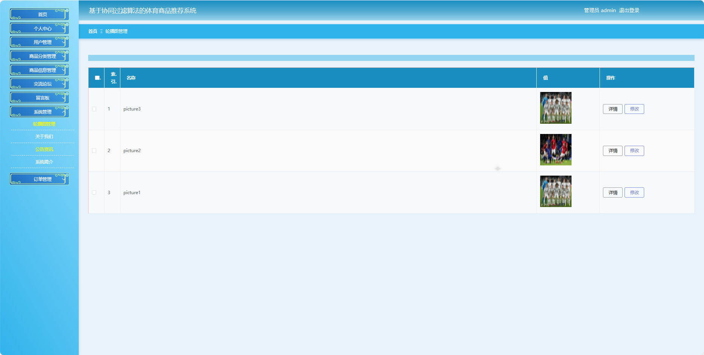

## 基于SpringBoot的体育商品推荐系统(程序+报告)

###  获取sql数据库文件: 从戎源码网 (https://armycodes.com/) QQ: 386869957 QQ群: 377586148
###  所有系统地址: (https://github.com/YuLin-Coder/AllProjectCatalog) 
###  所有项目以及源代码本人均调试运行无问题 可支持远程安装部署调试、定制修改、代码讲解

## 项目介绍
基于SpringBoot的体育商品推荐系统，系统包含两种角色：管理员、用户主要功能如下。

### 【管理员】:
1. **首页：** 查看体育商品推荐系统。
2. **个人中心：** 修改密码、管理个人信息。
3. **用户管理：** 审核和管理注册用户的信息。
4. **商品分类管理：** 管理体育商品的分类信息。
5. **商品信息管理：** 监管和管理体育商品的信息。
6. **交流论坛：** 管理用户间的讨论和交流，包括删除不当内容。
7. **留言板：** 管理用户的留言，进行适当的处理。
8. **系统管理：**
   - **轮播图管理：** 管理系统首页的轮播图，包括添加、编辑和删除。
   - **关于我们：** 编辑和更新关于体育商品推荐系统的介绍。
   - **公告资讯：** 发布、编辑和删除系统的通知和公告。
   - **系统简介：** 提供体育商品推荐系统的简要介绍。
9. **订单管理：**
   - **已退款订单：** 查看和管理已退款的订单信息。
   - **未支付订单：** 查看和管理未支付的订单信息。
   - **已发货订单：** 查看和管理已发货但未完成的订单信息。
   - **已支付订单：** 查看和管理已支付但未完成的订单信息。
   - **已完成订单：** 查看和管理已完成的订单信息。
   - **已取消订单：** 查看和管理已取消的订单信息。

### 【用户】:
1. **首页：** 浏览体育商品推荐系统的主要信息。
2. **商品信息：** 查看系统推荐的体育商品。
3. **交流论坛：** 参与用户间的体育商品讨论和交流。
4. **公告资讯：** 查看系统发布的重要通知和体育商品资讯。
5. **留言板：** 发表个人意见和留言，参与系统互动。
6. **购物车：** 查看已选购的体育商品，进行结算和下单。
7. **个人中心：** 管理个人信息，查看订单历史和进行相关操作。

## 项目技术
- 编程语言：Java
- 数据库：MySQL
- 项目管理工具：Maven
- 前端技术：HTML、CSS、JavaScript、Jquery、Vue
- 后端技术：Spring、SpringMVC、MyBatis

## 运行环境
- JDK版本：JDK1.8及以上
- 开发工具：IDEA、Ecplise、Myecplise都可以
- 数据库: MySQL5.7及以上
- Maven：maven3.0及以上
- Node：14.14.0及以上

## 运行截图

